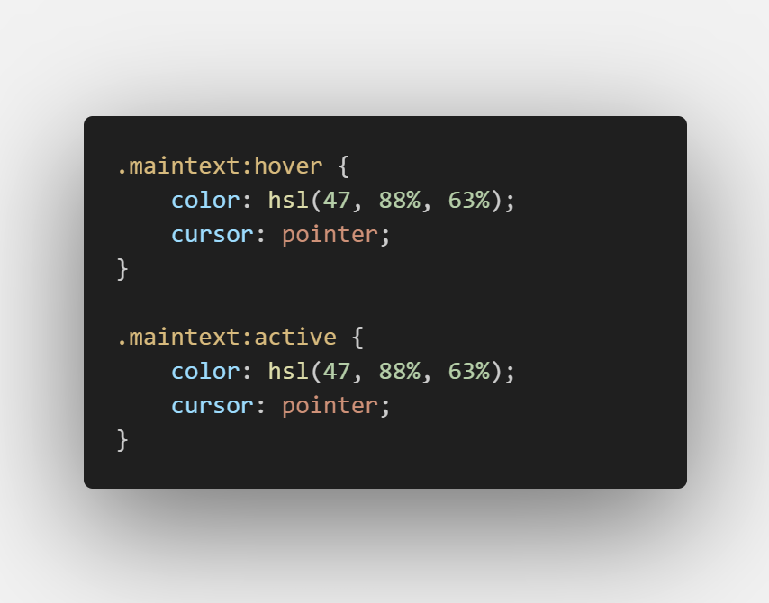
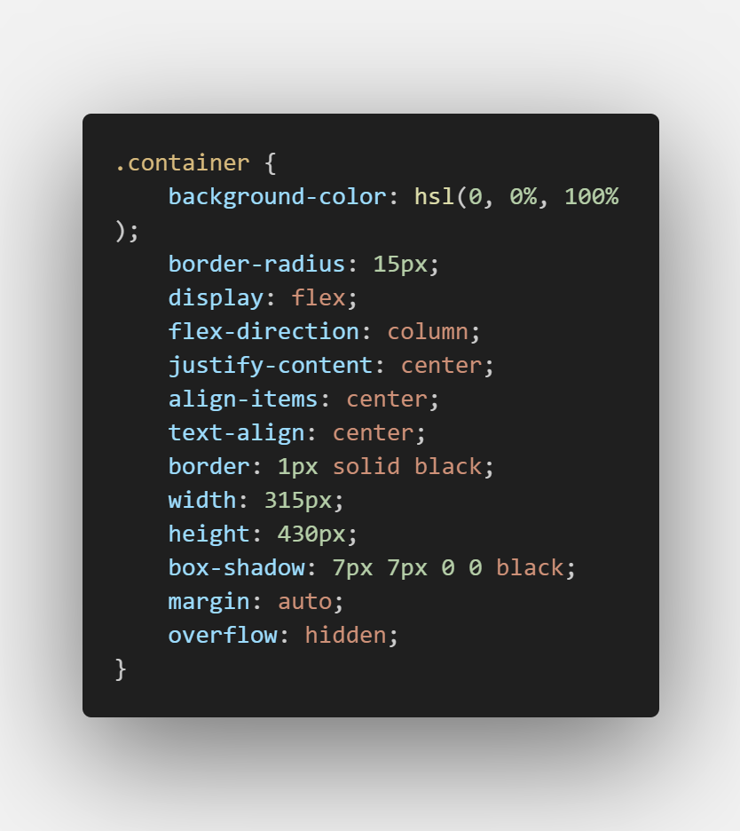

# Frontend Mentor - Blog preview card solution

This is a solution to the [Blog preview card challenge on Frontend Mentor](https://www.frontendmentor.io/challenges/blog-preview-card-ckPaj01IcS). Frontend Mentor challenges help you improve your coding skills by building realistic projects. 

## Table of contents

- [Overview](#overview)
  - [The challenge](#the-challenge)
  - [Screenshot](#screenshot)
  - [Links](#links)
- [My process](#my-process)
  - [Built with](#built-with)
  - [What I learned](#what-i-learned)
  - [Continued development](#continued-development)

- [Author](#author)


## Overview

### The challenge

Users should be able to:

- See hover and focus states for all interactive elements on the page

### Screenshot




### Links

- Solution URL: [Add solution URL here](https://your-solution-url.com)
- Live Site URL: [Add live site URL here](https://your-live-site-url.com)

## My process

### Built with

- HTML5 markup
- CSS custom properties
- Flexbox
- Media Query

### What I learned

```css
@media screen and (max-width: 320px) {
    .container {
        width: 315px;
        overflow: hidden;
    }

    .asset {
        width: 90%;
        margin-top: 30px;
    }

    .container,
    .asset {
        max-width: 90%;
    }

    .image,
    .card-text,
    .author {
        display: flex;
        flex-direction: column;
        justify-content: center;
        align-items: center;
        width: 100%;
    }

    .learning {
        margin-left: -175px;
        text-align: center;
    }

    .published {
        margin-left: 30px;
        padding: 0;
        margin-top: 0;
    }

    .maintext {
        margin-left: 10px;
        font-size: 1.2rem;
        margin-top: 0;
    }

    .description {
        margin-left: 15px;
        font-size: 0.7rem;
        font-weight: 500;
        line-height: 18px;
        margin-top: 0;
    }

    .imgauthor {
        margin-left: 35px;
        margin-top: 20px;
    }

    .name {
        text-align: center;
        margin-left: 25px;
    }
}

```

```css
@font-face {
    font-family: "Page";
    src: url('assets/fonts/Figtree-VariableFont_wght.ttf');
}
```
Learnt how to add media queries, and edit them according to the device specifications, and using @fontface to add fonts locally.


### Continued development

- Responsiveness
- Flexbox


## Author

- Frontend Mentor - [Isaac-Victor Providence](https://www.frontendmentor.io/profile/Emoji123-s)
- Twitter - [Divine Providence](https://twitter.com/p_r_o_v_i_dence)
- Github - [Isaac-Victor Providence](https://github.com/Emoji123-s)